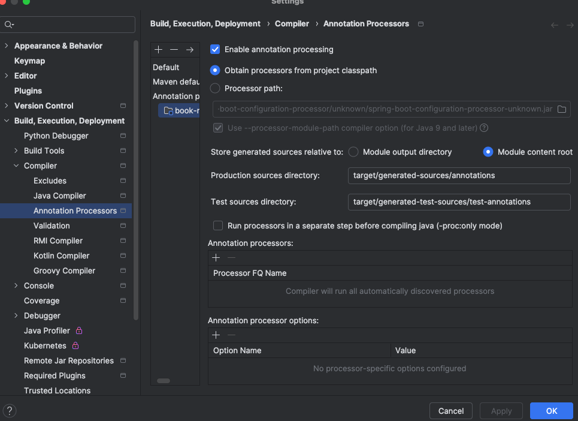

## BookMyShow

### Initial Questions To ask

#### Step - 0

- Do you want a complete booking system[correct]? or Entites?
- How user intracts with the system? commandline[correct]/ rest api?
- Do you want to persist data in memory or Actual DB[correct].

#### Step -1

##### User journey
- User -> Region -> Theater -> Movie -> show -> seats -> Payment -> Confirmation[Done]

##### Requirements
- User should be able to search by name and Search by Genre.
- User should be able to book a ticket.
- User should be able to book a particular show and seats!
- Region has multiple theaters(to be supported) and multiple screens
- Are we supporting only movies or shows also? only movies[Clarifing]
- Multiple Screens are there in one theater.

##### Clarifying Questions
- What does the user book? Seat of show
- what is a show? Movie played at a particular time + at a screen
- User should be able to book only 10seats at one time.
- No two people should be able to book a seat.
- How price is calculated?
    - Price of Show is calc -> screen+Movie+theater+Region
    - Show consists of time + seat type[gold/platinum]
- How are payments integrated? -> Third party api's
    - What design Patterns are used here?
        - Adapter Design Patter - Third Party
        - Strategy to choose b/w multiple Third party companies
- User should be able to cancel a show/booking
- Addons like popcorn/coke/nachos..
- Do we need to store info the movies? cast/genre/duration/language.
- Features: 4k, 2k 1080p Movie but the screen should also support this
    - Show should support this features as Movie played at particular screen -> show
- Concurrency
    - Why are we[bookmyshow] maintaining the movies info? As bookmyshow/paytm.. can book tickets at same time
    - Shouldnt the theaters maintain it and we make api call to it and they handle the concurrency
    - To show the feature of concurrency between our users to bookmyshow we are maintaining the movie info.

#### Step -2 [Class Diagram]

#### Step -3 [Cardinality & ER Diagram]

- How to auto generate ER - Refer [Blog](https://medium.com/@tushar0618/how-to-create-er-diagram-of-a-database-in-mysql-workbench-209fbf63fd03)

### Developer Reference
#### [Initialize Spring Project]

#### [Swagger URL]
- http://localhost:8080/swagger-ui/index.html

#### Encrypting password
- mvnrepository.com -> spring-boot-starter-security

### Project Setup Issues
##### Issue - 1 - MySqlWorkBench Unable to connect to Localhost:3306
- Uninstall and reInstall[brew install --cask mysqlworkbench
  ]
- Remove the cache
  - rm -rf ~/Library/Application\ Support/MySQL/Workbench
    rm -rf ~/Library/Preferences/com.oracle.mysql.workbench.plist
    rm -rf ~/Library/Saved\ Application\ State/com.oracle.mysql.workbench.savedState
- Try now it will work / User id and pwd -> check note book

##### Issue - 2 - Lombok Getter and Setter Issue

### Development Issues and Resolutions
##### Issue - 1 
- Error: Entity 'com.backend.BookMyShowBackend.models.Theater' has no identifier (every '@Entity' class must declare or inherit at least one '@Id' or '@EmbeddedId' property)
- @OneToMany(fetch = FetchType.LAZY, mappedBy = "region_id")
  private List<Theater> theaters;
- mappedBy = "region_id" -> mappedBy = "region"//it should be object name not db table id

##### Issue - 2
- Error: Swagger endpoints not showing up..
- Need to add below as Swagger UI is not finding the API docs, try adding this [Manual Loading of API Docs.]
- springdoc.swagger-ui.urls[0].name=BookMyShow API
  springdoc.swagger-ui.urls[0].url=/v3/api-docs
### Pending Implementations
- Swagger [Done]
- Frontend
- REST Impl
- Decorator - Addons Edible items
- Offer + Promo
- Email tickets to users once completed
- Data Seed() auto populate test data
- Application.yml config
- AWS pipline and ECS Deployment